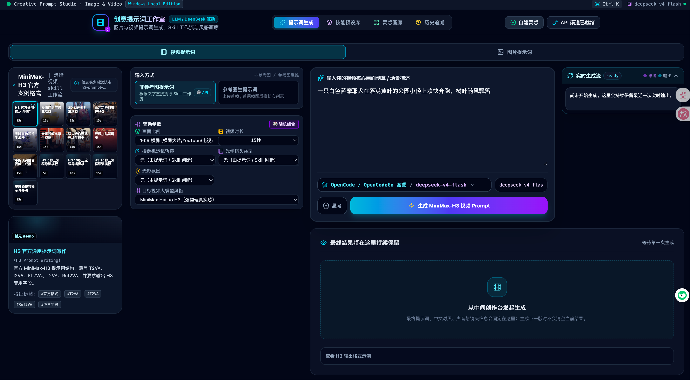
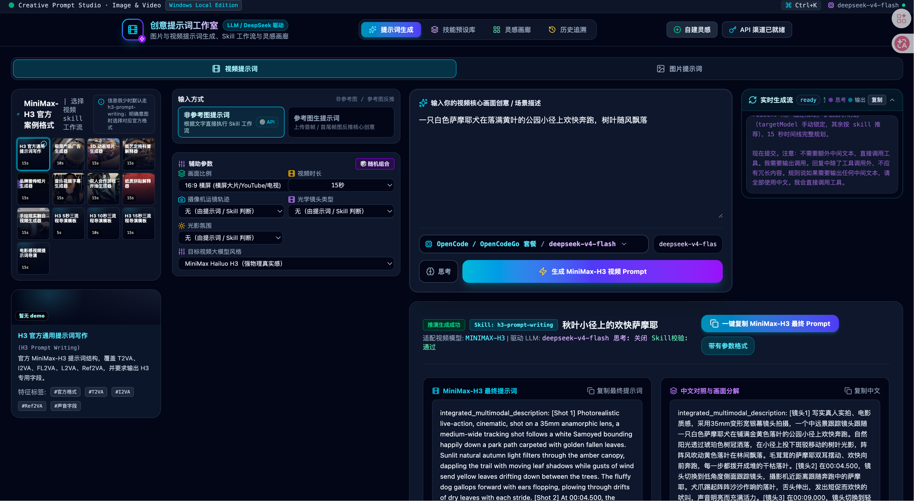
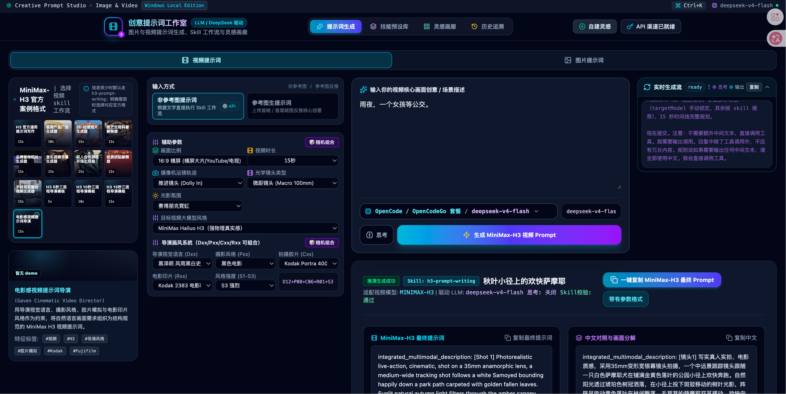
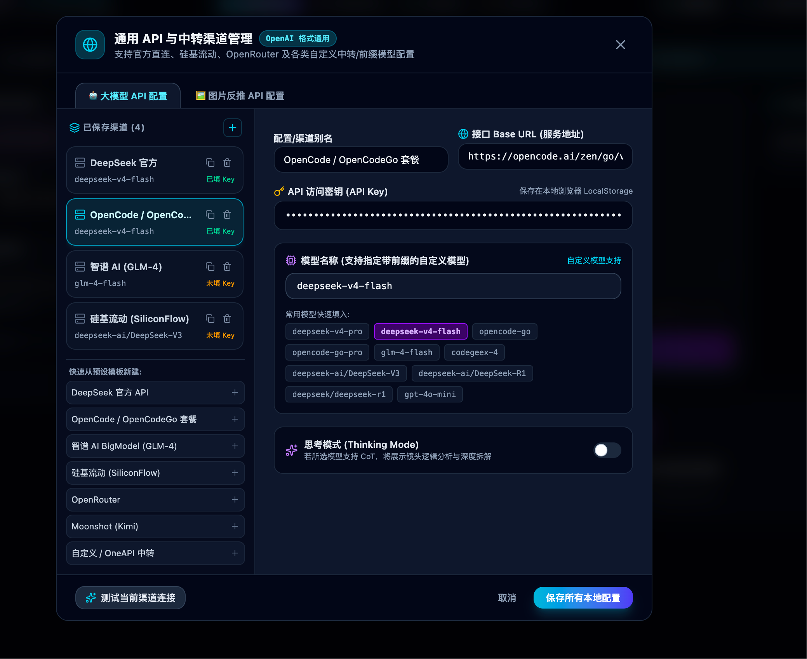
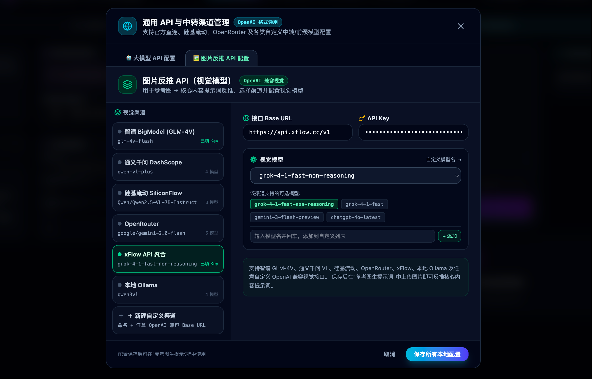

# MiniMax-H3 AI 视频生成器 & OpenPrompt 提示词预设画廊 (MiniMax Video Studio)

欢迎使用 **MiniMax-H3 AI 视频生成器 & 提示词预设灵感库**！本系统专为 MiniMax-H3 (海螺 AI)、Kling AI (可灵)、Runway Gen-3、Sora、Luma Dream Machine、Midjourney 等现代 AI 视频与图像大模型设计，提供专业的提示词工程推演、双轨同名视频自动匹配、OpenPrompt 高密度瀑布流画廊以及本地全盘文件持久化存储。

---

## 界面预览

<p align="center">
  
</p>

<p align="center"><strong>首页与提示词生成工作台</strong></p>

<table>
  <tr>
    <td width="50%"></td>
    <td width="50%"></td>
  </tr>
  <tr>
    <td align="center"><strong>预设生成界面</strong></td>
    <td align="center"><strong>多参数组合与末尾预设</strong></td>
  </tr>
</table>

<table>
  <tr>
    <td width="50%"></td>
    <td width="50%"></td>
  </tr>
  <tr>
    <td align="center"><strong>大模型 API 配置</strong></td>
    <td align="center"><strong>图片反推 API 配置</strong></td>
  </tr>
</table>

---

## 目录
1. [核心特色与设计理念](#核心特色与设计理念)
2. [本地数据存储与同名视频/图片匹配机制](#本地数据存储与同名视频图片匹配机制)
3. [OpenPrompt 瀑布流排版与智能懒加载](#openprompt-瀑布流排版与智能懒加载)
4. [预设提示词库与样本视频关联指南](#预设提示词库与样本视频关联指南)
5. [多 API 渠道配置与持久化存储](#多-api-渠道配置与持久化存储)
6. [本地二次开发与修改步骤说明](#本地二次开发与修改步骤说明)
7. [Windows / Mac 打包发布与部署](#windows--mac-打包发布与部署)

---

## 核心特色与设计理念

- **DeepSeek V4 + MiniMax-H3 视频提示词语法法则**：根据海螺 AI 视频模型物理引擎特点，自动生成结构化英文 Prompt、中文深度释义、运镜轨迹、镜头定焦与 Negative Prompt（排除项）。
- **OpenPrompt 高密度瀑布流画廊**：媲美 OpenPrompt 官方界面的多列 Masonry 瀑布流显示，支持按语言、来源、作者、模型、场景标签极速过滤。
- **智能懒加载 (Lazy Loading)**：针对成千上万个海量图片/视频案例，系统默认开启虚拟分批流式加载（20条/批），避免一次性加载过多媒体导致浏览器卡死或 Linux 服务器内存溢出。
- **本地全盘离线持久化**：不依赖外部云数据库，所有 API 配置、历史生成记录、技能预设、画廊案例均直接存储在本地 JSON 目录文件中。

---

## 本地数据存储与同名视频/图片匹配机制

系统所有数据均存放在项目根目录下的 **`./data/`** 文件夹中：

```text
/
├── data/
│   ├── config.json       # 存储 DeepSeek / OpenAI API 密钥、Base URL 与多渠道配置
│   ├── history.json      # 存储生成过的历史提示词记录
│   ├── skills.json       # 存储技能规则预设（如 cinematic_imax, vintage_vhs 等）
│   ├── gallery.json      # 存储灵感画廊的基础案例数据
│   └── media/            # [重点] 存储对应的提示词同名视频与图片预览文件
│       ├── cinematic_imax.mp4
│       ├── dark_fantasy.mp4
│       ├── vintage_vhs.mp4
│       ├── g-1.mp4
│       └── g-1.json (可选：同名 JSON 文件自动录入画廊)
```

### 1. 技能预设库同名匹配逻辑
- 当后端 REST API 服务 (`/api/skills`) 启动时，会自动扫描 `./data/media/` 目录。
- 若目录中存在文件名与 Skill ID 相同的视频或图片（例如 `cinematic_imax.mp4` 与 ID `cinematic_imax` 匹配），系统会自动将 `/api/media/cinematic_imax.mp4` 绑定为该技能的动态 preview URL。
- 前端 **技能预设库 (Skills Vault)** 页面及 **AI 生成器** 页面会自动展现对应的动态视频播放效果。

### 2. 灵感画廊双轨扫描机制
- 灵感画廊支持 **「同名 JSON + 视频/图片」** 自动录入。
- 用户只需在 `./data/media/` 中放置 `my_prompt_01.mp4` 和 `my_prompt_01.json`（里面包含 promptEn、title、tags 等信息），后端 API `/api/gallery` 即可将其自动录入画廊，无需手动配置数据库。

---

## OpenPrompt 瀑布流排版与智能懒加载

### 1. 高密度 Masonry 瀑布流
- 前端界面采用 CSS Multi-Column 瀑布流布局 (`columns-2` 至 `columns-6`)，卡片间距仅 10px。
- 卡片左上角悬浮模型 Badge（如 `Seedance 2.0`、`MINIMAX-H3`、`Midjourney`），右上角悬浮播放图标，鼠标悬停即可自动播放动态视频 preview。

### 2. 智能懒加载开关 (Lazy Loading)
- 导航栏提供 **「智能懒加载 (Lazy Load)」** 切换开关。
- **开启状态**：初始渲染 20 条，随页面向下滚动自动按需追加 16 条，保证即使有 10,000+ 个媒体案例也能保持 60 FPS 流畅操作。
- **关闭状态**：一次性全量载入所有结果（适合少量条目精细查找）。

---

## 预设提示词库与样本视频关联指南

如果您希望为自带的预设提示词提供效果示例视频，只需以下 3 步：

1. **界面打开目录**：在「提示词预设库」或「灵感画廊」页面右上角，点击 **「打开 data/media 目录」** 按钮，系统会自动调用 Windows Explorer / Mac Finder 打开本地文件夹。
2. **视频同名命名**：将您的演示视频或图片重命名为对应的预设 ID（例如 `vintage_vhs.mp4` 或 `dark_fantasy.jpg`）。
3. **刷新页面**：重新加载网页，系统会自动拉取同名视频并在预设卡片中提供悬停播放 preview！

---

## 多 API 渠道配置与持久化存储

系统内置多渠道 API 管理，配置文件保存在 `./data/config.json`：

- **API Key & Custom Base URL**：支持 DeepSeek 官方 API (`https://api.deepseek.com`)、硅基流动 (`https://api.siliconflow.cn/v1`)、OneAPI / NewAPI 中转站等。
- **连通性校验**：界面提供「测试 API 连通性」按钮，直接验证密钥与 Base URL 有效性。
- **配置持久化**：所有的保存修改都会通过 `/api/config` REST 接口同步保存至本地磁盘，重启程序或在 Linux 部署后设置依然保留。

---

## 本地二次开发与修改步骤说明

如果您希望将本项目下载到本地电脑（Windows / Mac / Linux）进行二次开发、定制 UI、新增 API 接口或修改提示词生成逻辑，请按照以下步骤操作：

### 1. 准备本地开发环境
请确保本地计算机已安装以下基础软件：
- **Node.js**：推荐 LTS 版本（v18.0.0 或 v20.0.0+）
- **Git**（可选）：用于代码版本管理与提交
- **代码编辑器**：推荐使用 Visual Studio Code (VS Code)

### 2. 下载/导出项目代码
1. 在 AI Studio 平台右上角，点击 **Settings** 菜单。
2. 选择 **Export as ZIP** 下载压缩包解压，或选择 **GitHub / Export Repo** 同步到您自己的 GitHub 账号后 `git clone` 到本地。

### 3. 安装项目依赖
在终端/命令行工具中进入项目解压后的根目录，运行依赖安装命令：

```bash
# 进入项目根目录
cd minimax-video-studio

# 安装 npm 依赖包
npm install
```

### 4. 配置文件与 API 密钥设置
系统支持两种 API 密钥配置方式：

- **方式一：通过界面图形化配置（推荐）**
  1. 启动项目后，在浏览器打开应用。
  2. 点击顶部导航栏的 **「系统配置」** 页面。
  3. 输入您的 DeepSeek API Key (或第三方中转 Base URL)，点击保存。配置将自动存入本地 `./data/config.json` 文件中。

- **方式二：环境变量或直接编辑 JSON 文件**
  - 可直接编辑 `./data/config.json` 文件：
    ```json
    {
      "apiKey": "sk-your-deepseek-api-key",
      "baseUrl": "https://api.deepseek.com",
      "model": "deepseek-v4-pro",
      "thinkingEnabled": true,
      "temperature": 0.7
    }
    ```
  - 或者创建根目录 `.env` 文件：
    ```env
    DEEPSEEK_API_KEY=sk-your-key-here
    DEEPSEEK_BASE_URL=https://api.deepseek.com
    ```

### 5. 启动本地开发服务与浏览器访问
运行以下开发命令，系统会使用 `tsx` 启动后端 `server.ts`，并集成 Vite 前端热重载中间件：

```bash
npm run dev
```

- **浏览器访问**：如果不打包为桌面应用，直接打开本地浏览器（Chrome、Edge、Safari 等），访问终端打印的地址（默认 **`http://localhost:3000`**）即可直接享用全部功能。
- **端口碰撞智能兼容（绝对不白屏）**：如果您的电脑上 `3000` 端口已经被其他本地程序占用，系统在启动时会自动探测并顺延绑定可用空闲端口（例如自动切换至 `http://localhost:3001` 或 `3002`），绝对不会出现因端口冲突导致程序崩溃或页面白屏！

### 6. 项目核心模块与二次开发文件指南

当您需要在本地修改或增加功能时，可参考以下关键源码目录结构：

| 文件 / 目录 | 功能与开发说明 | 修改建议 |
| :--- | :--- | :--- |
| **`server.ts`** | 全栈 Node.js Express 后端入口 | 修改/新增 REST API 路由（如扩展 API 代理、添加新画廊数据源、新增磁盘接口等）。 |
| **`src/App.tsx`** | 前端主界面与全局 Tab 导航 | 修改全局页面布局、增删顶部 Nav 标签页（AI 生成器、预设库、画廊、配置等）。 |
| **`src/components/PromptGenerator.tsx`** | AI 视频提示词生成核心页面 | 修改 DeepSeek 系统 Prompt、运镜参数推演算法、流式输出解析逻辑、界面表单。 |
| **`src/components/InspirationGallery.tsx`** | OpenPrompt 瀑布流画廊 | 修改瀑布流卡片排版、智能懒加载逻辑、标签过滤与卡片交互。 |
| **`src/components/SkillsVaultView.tsx`** | MiniMax 技能预设库 | 修改运镜参数展示格式、技能卡片布局与同名视频匹配交互。 |
| **`src/types.ts`** | 全局 TypeScript 数据结构接口 | 定义新实体类型（如新增字段、新模型枚举等）。 |
| **`data/`** | 本地全盘离线持久化数据目录 | 存放本地生成的 `config.json`、`history.json`、`skills.json` 及 `media/` 媒体文件。 |

### 7. 本地测试与构建打包
修改代码后，可通过以下命令进行代码检查与生产打包验证：

```bash
# 1. 运行代码语法与类型校验
npm run lint

# 2. 生产环境构建编译 (生成 dist/ 静态资源与打包 server.cjs)
npm run build

# 3. 本地启动生产预览服务
npm start
```

---

## Windows / Mac 打包发布与部署

### 1. 本地 Node.js 启动
```bash
# 1. 安装依赖
npm install

# 2. 启动开发与后端服务 (端口 3000)
npm run dev

# 3. 生产构建与启动
npm run build
npm start
```

### 2. 打包为 Windows / Mac 桌面应用 (Electron / Tauri)
项目支持通过脚本打包为独立 `.exe` / `.dmg` 桌面可执行文件。

```bash
# 执行打包脚本
chmod +x build.sh
./build.sh
```

---

*（注：本文档已自动保存到根目录 `README.md`，方便后续维护与 GitHub 开源部署查看）*
